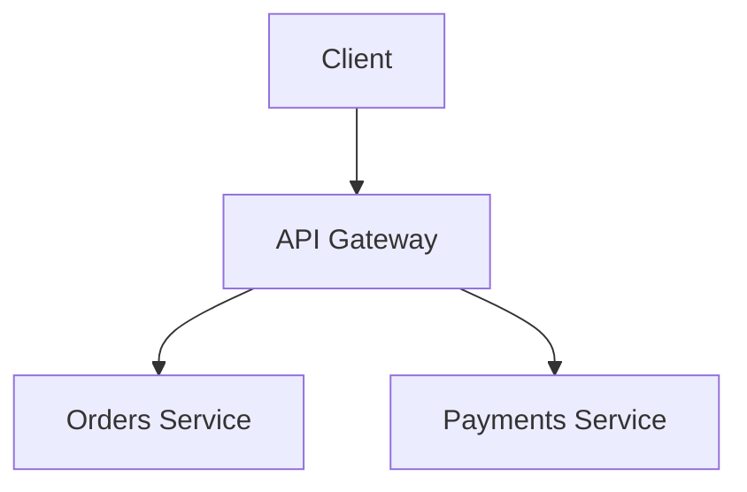

# poc-mkdocs

> **[Leia em Português](README.md)**

POC for technical documentation using [MkDocs](https://www.mkdocs.org/) with the [Material for MkDocs](https://squidfunk.github.io/mkdocs-material/) theme. The goal is to demonstrate how to create a modern, beautiful and interactive documentation site from scratch, with automatic deployment via GitHub Actions to GitHub Pages.

**Demo (PT-BR):** https://Allanhenriquee.github.io/poc-mkdocs

**Demo (EN):** https://Allanhenriquee.github.io/poc-mkdocs/en/

---

## Table of Contents

- [Overview](#overview)
- [What you will need](#what-you-will-need)
- [1. Installing Python](#1-installing-python)
- [2. Installing Git](#2-installing-git)
- [3. Creating a GitHub account](#3-creating-a-github-account)
- [4. Creating the repository](#4-creating-the-repository)
- [5. Cloning and structuring the project](#5-cloning-and-structuring-the-project)
- [6. Installing MkDocs Material](#6-installing-mkdocs-material)
- [7. Configuring mkdocs.yml](#7-configuring-mkdocsyml)
- [8. Creating pages in Markdown](#8-creating-pages-in-markdown)
- [9. Running locally](#9-running-locally)
- [10. Customizing the visual (CSS and JS)](#10-customizing-the-visual-css-and-js)
- [11. Creating a custom home page](#11-creating-a-custom-home-page)
- [12. Automatic deployment with GitHub Actions](#12-automatic-deployment-with-github-actions)
- [13. Enabling GitHub Pages](#13-enabling-github-pages)
- [Final project structure](#final-project-structure)
- [Resources and references](#resources-and-references)

---

## Overview

MkDocs converts Markdown files into a static website. The Material theme adds a modern UI layer with dark/light mode support, search, instant navigation and dozens of extensions.

This POC goes beyond the standard and includes:

- Fully customized home page with animated hero section
- Typing effect (typed text) with fade between words
- Animated counters via IntersectionObserver
- Cards with fade-in on scroll
- Parallax effect with mouse on background orbs
- Fully functional dark mode and light mode
- Automatic deployment on every push to the `main` branch

---

## What you will need

Before starting, you will need to install three tools on your computer:

| Tool | Purpose |
|------|---------|
| **Python 3.8+** | MkDocs is built with Python — it needs to be installed to run |
| **Git** | To version the project and push it to GitHub |
| **GitHub account** | To host the repository and publish the site for free |

The sections below walk you through installing each one.

---

## 1. Installing Python

### Windows

1. Go to [python.org/downloads](https://www.python.org/downloads/)
2. Click the **"Download Python 3.x.x"** button (latest version)
3. Run the downloaded installer
4. **Important:** on the first screen of the installer, check the **"Add Python to PATH"** option before clicking Install Now
5. Click **"Install Now"** and wait for the installation to complete
6. Open **Command Prompt** (press `Win + R`, type `cmd` and Enter)
7. Verify the installation:

```cmd
python --version
pip --version
```

You should see something like:
```
Python 3.12.0
pip 24.0
```

> If you get an error saying `python` is not recognized, restart your computer and try again. If the error persists, repeat the installation making sure to check "Add Python to PATH".

### macOS

macOS already comes with Python, but installing an updated version is recommended:

**Option A — Official installer (simplest):**

1. Go to [python.org/downloads](https://www.python.org/downloads/)
2. Download the `.pkg` installer for macOS
3. Run the downloaded file and follow the instructions
4. Open **Terminal** (Cmd + Space, type "Terminal")
5. Verify:

```bash
python3 --version
pip3 --version
```

**Option B — Homebrew (recommended for developers):**

```bash
# Install Homebrew (macOS package manager)
/bin/bash -c "$(curl -fsSL https://raw.githubusercontent.com/Homebrew/install/HEAD/install.sh)"

# Install Python
brew install python

# Verify
python3 --version
pip3 --version
```

> On macOS, use `python3` and `pip3` in commands instead of `python` and `pip`.

### Linux (Ubuntu/Debian)

```bash
# Update package list
sudo apt update

# Install Python and pip
sudo apt install python3 python3-pip python3-venv -y

# Verify
python3 --version
pip3 --version
```

---

## 2. Installing Git

### Windows

1. Go to [git-scm.com/download/win](https://git-scm.com/download/win)
2. The download starts automatically — run the installer
3. During installation, keep all default options and click **Next** until finished
4. Open **Command Prompt** and verify:

```cmd
git --version
```

### macOS

```bash
# Via Homebrew (recommended)
brew install git

# Or install Apple's command line tools (already includes Git)
xcode-select --install

# Verify
git --version
```

### Linux (Ubuntu/Debian)

```bash
sudo apt install git -y
git --version
```

### Initial Git configuration

After installing, set your name and email (used in commits):

```bash
git config --global user.name "Your Name"
git config --global user.email "your@email.com"
```

---

## 3. Creating a GitHub account

1. Go to [github.com](https://github.com)
2. Click **"Sign up"**
3. Enter your email, create a password and choose a username
4. Confirm the email you receive in your inbox
5. Done — your account is created

---

## 4. Creating the repository

1. Log in to GitHub
2. In the top right corner, click the **"+"** icon → **"New repository"**
3. Fill in the fields:
   - **Repository name:** `my-documentation` (or any name you prefer)
   - **Description:** `Technical documentation with MkDocs Material` (optional)
   - **Visibility:** `Public` (required for free GitHub Pages)
   - Check **"Add a README file"**
4. Click **"Create repository"**

---

## 5. Cloning and structuring the project

### Cloning the repository

With the repository created, clone it to your computer. Open the terminal and run:

```bash
git clone https://github.com/YOUR_USERNAME/my-documentation.git
cd my-documentation
```

Replace `YOUR_USERNAME` with your GitHub username and `my-documentation` with the name of the repository you created.

### Creating the folder structure

```bash
# Create the required folders
mkdir -p docs/stylesheets
mkdir -p docs/javascripts
mkdir -p overrides
mkdir -p .github/workflows
```

### Creating requirements.txt

Create the `requirements.txt` file at the project root with the following content:

```
mkdocs-material>=9.5
```

---

## 6. Installing MkDocs Material

It is good practice to use a **virtual environment** to isolate project dependencies and avoid installing packages globally on your system.

### Creating and activating the virtual environment

```bash
# Create the virtual environment (run at the project root)
python -m venv .venv
```

> On macOS/Linux, use `python3` instead of `python` if the command above does not work.

**Activating the virtual environment:**

```bash
# Windows (Command Prompt)
.venv\Scripts\activate

# Windows (PowerShell)
.venv\Scripts\Activate.ps1

# macOS / Linux
source .venv/bin/activate
```

After activating, you will see `(.venv)` at the beginning of the terminal line — this indicates the environment is active.

> To deactivate the virtual environment at any time, run `deactivate`.

### Installing dependencies

With the virtual environment active, install MkDocs Material:

```bash
pip install -r requirements.txt
```

Verify the installation was successful:

```bash
mkdocs --version
```

You should see something like:
```
mkdocs, version 1.6.x
```

---

## 7. Configuring mkdocs.yml

The `mkdocs.yml` is the central file of the project — it defines the site name, theme, navigation, extensions and much more.

Create the `mkdocs.yml` file at the project root (replace values marked with `YOUR_USERNAME` and `REPO_NAME`):

```yaml
site_name: My Documentation
site_description: Technical documentation for my platform
site_author: Your Name
# Replace with your GitHub username and repository name
site_url: https://YOUR_USERNAME.github.io/REPO_NAME

repo_name: YOUR_USERNAME/REPO_NAME
repo_url: https://github.com/YOUR_USERNAME/REPO_NAME

theme:
  name: material
  custom_dir: overrides        # Folder for custom HTML templates
  language: en
  font:
    text: Inter                # Main font (loaded from Google Fonts)
    code: JetBrains Mono       # Font for code blocks
  palette:
    # Dark mode (default when opening the site)
    - scheme: slate
      primary: custom
      accent: cyan
      toggle:
        icon: material/brightness-4
        name: Switch to light mode
    # Light mode
    - scheme: default
      primary: custom
      accent: cyan
      toggle:
        icon: material/brightness-7
        name: Switch to dark mode
  features:
    - navigation.instant           # SPA navigation without page reload
    - navigation.instant.progress  # Progress bar during navigation
    - navigation.tracking          # Updates URL when scrolling between sections
    - navigation.tabs              # Tabs at the top for main sections
    - navigation.tabs.sticky       # Tabs stay fixed when scrolling
    - navigation.sections          # Groups pages into sections in the sidebar
    - navigation.top               # "Back to top" button
    - navigation.footer            # Previous/next page links in the footer
    - search.suggest               # Auto-suggestions in search
    - search.highlight             # Highlights searched terms on the page
    - search.share                 # Button to share search
    - content.code.annotate        # Allows annotations in code blocks
    - content.code.copy            # Copy button on all code blocks
    - content.tooltips             # Tooltips on internal links
    - toc.follow                   # Side index follows the scroll
  icon:
    repo: fontawesome/brands/github
    logo: material/rocket-launch

# Extra CSS and JS files
extra_css:
  - stylesheets/extra.css

extra_javascript:
  - javascripts/extra.js

plugins:
  - search:
      lang: en

# Markdown extensions
markdown_extensions:
  - admonition                     # Alert blocks (note, warning, tip...)
  - pymdownx.details               # Expandable blocks (click to open)
  - pymdownx.superfences           # Advanced and nested code blocks
  - pymdownx.highlight:
      anchor_linenums: true        # Links to line numbers in code
  - pymdownx.inlinehilite          # Inline code highlighting
  - pymdownx.tabbed:
      alternate_style: true        # Tabs inside pages
  - pymdownx.emoji:
      emoji_index: !!python/name:material.extensions.emoji.twemoji
      emoji_generator: !!python/name:material.extensions.emoji.to_svg
  - tables
  - toc:
      permalink: true              # Adds anchor link to each heading
  - attr_list
  - md_in_html

# Site navigation structure
nav:
  - Home: index.md
  - Architecture:
      - Overview: architecture/overview.md
  - API:
      - Reference: api/reference.md
  - Guides:
      - Local Setup: guides/local-setup.md
```

---

## 8. Creating pages in Markdown

Each `.md` file inside the `docs/` folder becomes a page on the site. Create the structure below:

### Home page — `docs/index.md`

```markdown
---
template: home.html
title: Home
hide:
  - navigation
  - toc
---
```

> This file uses a custom template. See the section [Creating a custom home page](#11-creating-a-custom-home-page).

### Architecture page — `docs/architecture/overview.md`

````markdown
# Architecture Overview

Describe your system architecture here.

## Diagram



## Components

| Component   | Responsibility               |
|-------------|------------------------------|
| API Gateway | Routing and authentication   |
| Orders Service | Order lifecycle management |
````

### API page — `docs/api/reference.md`

````markdown
# API Reference

## POST /api/orders

Creates a new order.

!!! info "Authentication"
    This endpoint requires a valid JWT token in the `Authorization` header.

**Request body:**

```json
{
  "customerId": "uuid",
  "items": [
    { "productId": "uuid", "quantity": 2 }
  ]
}
```

**Success response (201):**

```json
{
  "id": "uuid",
  "status": "pending",
  "createdAt": "2025-01-01T00:00:00Z"
}
```
````

### Examples of Material features

**Alert blocks:**

```markdown
!!! note "Note"
    An informative note.

!!! warning "Warning"
    Something the reader needs to be careful about.

!!! tip "Tip"
    A useful suggestion.

!!! danger "Danger"
    An irreversible or dangerous action.
```

**Expandable blocks:**

```markdown
??? info "Click to expand"
    Content hidden by default.
```

**Tabs inside a page:**

````markdown
=== "macOS / Linux"
    ```bash
    source .venv/bin/activate
    ```

=== "Windows"
    ```cmd
    .venv\Scripts\activate
    ```
````

---

## 9. Running locally

With everything configured, start the development server:

```bash
mkdocs serve
```

Access in the browser: [http://127.0.0.1:8000](http://127.0.0.1:8000)

The server has **hot-reload**: any change to `.md`, `.css`, `.js` files or `mkdocs.yml` automatically updates the site in the browser.

To stop the server, press `Ctrl + C` in the terminal.

> **Tip:** if port 8000 is in use, choose another port:
> ```bash
> mkdocs serve --dev-addr=127.0.0.1:8080
> ```

---

## 10. Customizing the visual (CSS and JS)

### CSS — theme colors and variables

Create the file `docs/stylesheets/extra.css`. Material for MkDocs exposes CSS variables you can override separately for dark mode and light mode:

```css
/* ===== Dark mode ===== */
[data-md-color-scheme="slate"] {
  --md-primary-fg-color: #7c3aed;   /* Primary color (violet) */
  --md-accent-fg-color:  #06b6d4;   /* Accent color (cyan) */

  /* Custom variables used in the CSS */
  --color-primary:       #7c3aed;
  --color-primary-light: #a78bfa;
  --color-accent:        #06b6d4;
  --color-bg:            #09090f;
  --color-surface:       rgba(255, 255, 255, 0.04);
  --color-border:        rgba(255, 255, 255, 0.08);
  --color-text:          #e2e8f0;
  --color-text-muted:    #94a3b8;
}

/* ===== Light mode ===== */
[data-md-color-scheme="default"] {
  --md-primary-fg-color: #7c3aed;
  --md-accent-fg-color:  #0891b2;

  --color-primary:       #7c3aed;
  --color-primary-light: #6d28d9;
  --color-accent:        #0891b2;
  --color-bg:            #f8f9ff;
  --color-surface:       rgba(0, 0, 0, 0.03);
  --color-border:        rgba(0, 0, 0, 0.08);
  --color-text:          #1e293b;
  --color-text-muted:    #64748b;
}
```

> To discover which variables Material exposes, inspect the site HTML with your browser's developer tools (F12) and look for variables prefixed with `--md-`.

### CSS — glassmorphism effect

```css
.my-card {
  background: var(--color-surface);
  border: 1px solid var(--color-border);
  border-radius: 16px;
  backdrop-filter: blur(12px);
  -webkit-backdrop-filter: blur(12px);
  padding: 2rem;
  transition: border-color 0.2s ease, transform 0.2s ease;
}

.my-card:hover {
  border-color: var(--color-primary);
  transform: translateY(-4px);
}
```

### CSS — gradient text

```css
.gradient-text {
  background: linear-gradient(135deg, #7c3aed 0%, #06b6d4 100%);
  -webkit-background-clip: text;
  -webkit-text-fill-color: transparent;
  background-clip: text;
  display: inline-block; /* required for the gradient to work */
}
```

### CSS — fade-in on scroll animation

```css
.fade-in {
  opacity: 0;
  transition: opacity 0.6s ease;
}

.fade-in.visible {
  opacity: 1;
}
```

### Custom JavaScript

Create `docs/javascripts/extra.js`.

**Critical point:** with `navigation.instant` active, the site works as a SPA (Single Page Application). The `DOMContentLoaded` event only fires on the first page load. To ensure your scripts run on every navigation, use the `document$` observable that Material exposes:

```js
function boot() {
  initScrollAnimations();
  // Add other initializations here
}

// document$ is a RxJS observable from MkDocs Material.
// It emits an event on every page swap in instant navigation.
if (typeof document$ !== 'undefined') {
  document$.subscribe(boot);
} else {
  // Fallback when navigation.instant is disabled
  document.addEventListener('DOMContentLoaded', boot);
}
```

**Fade-in animation with IntersectionObserver:**

```js
function initScrollAnimations() {
  const elements = document.querySelectorAll('.fade-in');
  if (!elements.length) return;

  const observer = new IntersectionObserver((entries) => {
    entries.forEach(entry => {
      if (entry.isIntersecting) {
        entry.target.classList.add('visible');
        observer.unobserve(entry.target); // Stop observing after animating
      }
    });
  }, {
    threshold: 0.08,
    rootMargin: '0px 0px 80px 0px' // Triggers animation before reaching the viewport
  });

  elements.forEach(el => observer.observe(el));
}
```

Add the `fade-in` class to any HTML element in your template to activate the effect:

```html
<div class="my-card fade-in">
  Content that appears with fade on scroll
</div>
```

**Cleanup between navigations:**

When the user navigates between pages with `navigation.instant`, observers and event listeners accumulate if not cleaned up. Always clean up before reinitializing:

```js
let _scrollObserver = null;

function cleanup() {
  if (_scrollObserver) {
    _scrollObserver.disconnect();
    _scrollObserver = null;
  }
}

function boot() {
  cleanup(); // Clean previous state before initializing
  initScrollAnimations();
}
```

---

## 11. Creating a custom home page

To create a home page completely outside of the standard Markdown content layout:

### Step 1 — Configure `docs/index.md`

```markdown
---
template: home.html
title: Home
hide:
  - navigation
  - toc
---
```

The `template: home.html` frontmatter instructs MkDocs to use your custom template instead of the standard layout.

### Step 2 — Create `overrides/home.html`

```html



{{ super() }}

<!-- Hero section -->
<div class="hero">
  <div class="hero-content">
    <h1 class="hero-title">
      My Documentation
    </h1>
    <p class="hero-subtitle">
      Description of your platform.
    </p>
    <div class="hero-actions">
      <a href="architecture/overview/" class="btn btn--primary">
        Get Started
      </a>
    </div>
  </div>
</div>

<!-- Features section -->
<div class="features-section">
  <div class="features-grid">
    <a href="architecture/overview/" class="feature-card fade-in">
      <h3>Architecture</h3>
      <p>System overview.</p>
    </a>
    <a href="api/reference/" class="feature-card fade-in">
      <h3>API</h3>
      <p>Endpoint reference.</p>
    </a>
  </div>
</div>



{# Remove the default Markdown content (index.md is empty) #}

{{ super() }}
```

> The `` block renders right below the navigation bar, before the page content — the ideal place for heroes and featured sections.

### Step 3 — Declare `custom_dir` in `mkdocs.yml`

```yaml
theme:
  name: material
  custom_dir: overrides   # Folder where custom templates are stored
```

MkDocs will automatically look for `overrides/home.html` when a page uses `template: home.html`.

---

## 12. Automatic deployment with GitHub Actions

GitHub Actions lets you run tasks automatically in response to repository events — such as deploying the site every time you push to the `main` branch.

### Creating the workflow

Create the file `.github/workflows/deploy-docs.yml`:

```yaml
name: Deploy Docs

on:
  push:
    branches:
      - main          # Runs automatically on every push to main
  workflow_dispatch:  # Allows manual runs from the GitHub interface

permissions:
  contents: write     # Required to push to the gh-pages branch

jobs:
  deploy:
    runs-on: ubuntu-latest

    steps:
      # 1. Download the repository code
      - uses: actions/checkout@v4
        with:
          fetch-depth: 0    # Full history required for mkdocs gh-deploy

      # 2. Set up Python in the environment
      - uses: actions/setup-python@v5
        with:
          python-version: '3.x'

      # 3. Install MkDocs Material
      - name: Install dependencies
        run: pip install mkdocs-material

      # 4. Build and deploy to the gh-pages branch
      - name: Deploy to GitHub Pages
        run: mkdocs gh-deploy --force
```

### What does `mkdocs gh-deploy` do?

The command `mkdocs gh-deploy --force`:

1. Runs the site build (converts Markdown to HTML, CSS, JS)
2. Creates the `gh-pages` branch in the repository (if it does not exist)
3. Pushes the generated content to that branch
4. GitHub Pages then serves the content from that branch publicly

### Pushing everything to GitHub

```bash
# Add all files
git add .

# Create the initial commit
git commit -m "docs: initial MkDocs Material setup"

# Push to GitHub
git push origin main
```

After pushing, go to the **Actions** tab in your GitHub repository to follow the workflow execution in real time.

---

## 13. Enabling GitHub Pages

After the first deployment runs successfully (Actions tab → green workflow), configure GitHub Pages:

1. On GitHub, access your repository
2. Click **Settings** (gear icon)
3. In the left sidebar, click **Pages**
4. Under **Source**, select **"Deploy from a branch"**
5. In the **Branch** field, select **`gh-pages`** and the folder **`/ (root)`**
6. Click **Save**

Wait a few minutes. Your site will be available at:

```
https://YOUR_USERNAME.github.io/REPO_NAME
```

> **Tip:** the exact URL appears on the Settings → Pages page itself after configuration.

### Verifying the deployment

On every push to the `main` branch:

1. GitHub Actions runs the workflow (~1 to 2 minutes)
2. Content is updated in the `gh-pages` branch
3. GitHub Pages publishes the updated version (~1 to 2 minutes)

You can track the status in the **Actions** tab of the repository.

---

> **Private repository:** GitHub Pages with private repositories requires the **GitHub Pro** plan or higher for public access. If you want to keep the repository private, consider alternatives like [Cloudflare Pages](https://pages.cloudflare.com/) or [Netlify](https://www.netlify.com/), which offer free plans with private repository support.

---

## Final project structure

```
my-documentation/
├── .github/
│   └── workflows/
│       └── deploy-docs.yml        # Automatic deployment pipeline
├── docs/                          # All content in Markdown
│   ├── index.md                   # Home page (uses custom template)
│   ├── architecture/
│   │   └── overview.md            # Architecture page
│   ├── api/
│   │   └── reference.md           # API reference
│   ├── guides/
│   │   └── local-setup.md         # Setup guide
│   ├── stylesheets/
│   │   └── extra.css              # Custom CSS
│   └── javascripts/
│       └── extra.js               # Animations and interactivity
├── overrides/
│   └── home.html                  # Home page HTML template
├── mkdocs.yml                     # Main MkDocs configuration
├── requirements.txt               # Python dependencies
└── README.md
```

---

## Resources and references

| Resource | Version | Description |
|----------|---------|-------------|
| [MkDocs](https://www.mkdocs.org/) | latest | Static site generator for documentation |
| [Material for MkDocs](https://squidfunk.github.io/mkdocs-material/) | >= 9.5 | Theme with modern UI and advanced extensions |
| [GitHub Actions](https://docs.github.com/en/actions) | — | CI/CD pipeline for automatic deployment |
| [GitHub Pages](https://pages.github.com/) | — | Free hosting for static sites |
| [Inter](https://fonts.google.com/specimen/Inter) | — | Main font (via Google Fonts) |
| [JetBrains Mono](https://fonts.google.com/specimen/JetBrains+Mono) | — | Font for code blocks |

**Official documentation:**

- [MkDocs — User Guide](https://www.mkdocs.org/user-guide/)
- [Material for MkDocs — Getting Started](https://squidfunk.github.io/mkdocs-material/getting-started/)
- [Material for MkDocs — Customization](https://squidfunk.github.io/mkdocs-material/customization/)
- [Material for MkDocs — Publishing your site](https://squidfunk.github.io/mkdocs-material/publishing-your-site/)
- [GitHub Actions — Quickstart](https://docs.github.com/en/actions/quickstart)
- [GitHub Pages — Getting started](https://docs.github.com/en/pages/getting-started-with-github-pages)
