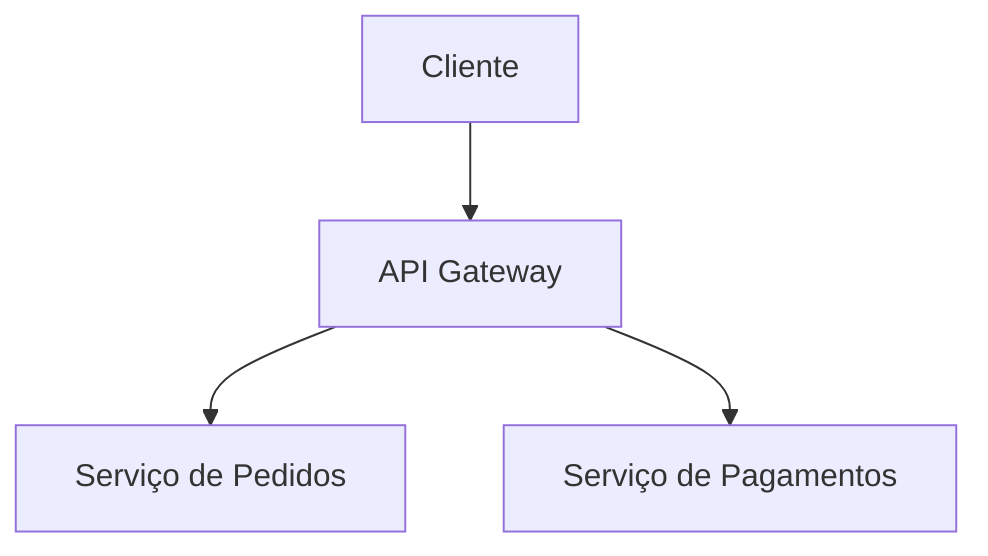

# poc-mkdocs

POC de documentação técnica utilizando [MkDocs](https://www.mkdocs.org/) com o tema [Material for MkDocs](https://squidfunk.github.io/mkdocs-material/). O objetivo é demonstrar como criar um site de documentação moderno, bonito e interativo do zero, com deploy automático via GitHub Actions no GitHub Pages.

**Demo:** https://Allanhenriquee.github.io/poc-mkdocs

---

## Índice

- [Visão geral](#visão-geral)
- [O que você vai precisar](#o-que-você-vai-precisar)
- [1. Instalando o Python](#1-instalando-o-python)
- [2. Instalando o Git](#2-instalando-o-git)
- [3. Criando uma conta no GitHub](#3-criando-uma-conta-no-github)
- [4. Criando o repositório](#4-criando-o-repositório)
- [5. Clonando e estruturando o projeto](#5-clonando-e-estruturando-o-projeto)
- [6. Instalando o MkDocs Material](#6-instalando-o-mkdocs-material)
- [7. Configurando o mkdocs.yml](#7-configurando-o-mkdocsyml)
- [8. Criando páginas em Markdown](#8-criando-páginas-em-markdown)
- [9. Executando localmente](#9-executando-localmente)
- [10. Customizando o visual (CSS e JS)](#10-customizando-o-visual-css-e-js)
- [11. Criando uma home page personalizada](#11-criando-uma-home-page-personalizada)
- [12. Deploy automático com GitHub Actions](#12-deploy-automático-com-github-actions)
- [13. Habilitando o GitHub Pages](#13-habilitando-o-github-pages)
- [Estrutura final do projeto](#estrutura-final-do-projeto)
- [Recursos e referências](#recursos-e-referências)

---

## Visão geral

O MkDocs converte arquivos Markdown em um site estático. O tema Material adiciona uma camada de UI moderna com suporte a dark/light mode, pesquisa, navegação instantânea e dezenas de extensões.

Esta POC vai além do padrão e inclui:

- Home page completamente customizada com hero section animada
- Efeito de digitação (typed text) com fade entre palavras
- Contadores animados via IntersectionObserver
- Cards com fade-in ao rolar a página
- Efeito parallax com mouse nos orbs do background
- Dark mode e light mode totalmente funcionais
- Deploy automático a cada push na branch `main`

---

## O que você vai precisar

Antes de começar, você vai precisar instalar três ferramentas no seu computador:

| Ferramenta | Para que serve |
|-----------|----------------|
| **Python 3.8+** | O MkDocs é feito em Python — ele precisa estar instalado para rodar |
| **Git** | Para versionar o projeto e enviar para o GitHub |
| **Conta no GitHub** | Para hospedar o repositório e publicar o site gratuitamente |

Nas seções abaixo você encontra o passo a passo completo para instalar cada um.

---

## 1. Instalando o Python

### Windows

1. Acesse [python.org/downloads](https://www.python.org/downloads/)
2. Clique no botão **"Download Python 3.x.x"** (versão mais recente)
3. Execute o instalador baixado
4. **Importante:** na primeira tela do instalador, marque a opção **"Add Python to PATH"** antes de clicar em Install Now
5. Clique em **"Install Now"** e aguarde a instalação
6. Após concluir, abra o **Prompt de Comando** (pressione `Win + R`, digite `cmd` e Enter)
7. Verifique a instalação:

```cmd
python --version
pip --version
```

Você deve ver algo como:
```
Python 3.12.0
pip 24.0
```

> Se aparecer um erro dizendo que `python` não foi reconhecido, reinicie o computador e tente novamente. Se o erro persistir, repita a instalação marcando a opção "Add Python to PATH".

### macOS

O macOS moderno já vem com Python, mas é recomendado instalar uma versão atualizada:

**Opção A — Instalador oficial (mais simples):**

1. Acesse [python.org/downloads](https://www.python.org/downloads/)
2. Baixe o instalador `.pkg` para macOS
3. Execute o arquivo baixado e siga as instruções
4. Abra o **Terminal** (Cmd + Espaço, digite "Terminal")
5. Verifique:

```bash
python3 --version
pip3 --version
```

**Opção B — Homebrew (recomendado para desenvolvedores):**

```bash
# Instalar o Homebrew (gerenciador de pacotes do macOS)
/bin/bash -c "$(curl -fsSL https://raw.githubusercontent.com/Homebrew/install/HEAD/install.sh)"

# Instalar o Python
brew install python

# Verificar
python3 --version
pip3 --version
```

> No macOS, use `python3` e `pip3` nos comandos em vez de `python` e `pip`.

### Linux (Ubuntu/Debian)

```bash
# Atualizar lista de pacotes
sudo apt update

# Instalar Python e pip
sudo apt install python3 python3-pip python3-venv -y

# Verificar
python3 --version
pip3 --version
```

---

## 2. Instalando o Git

### Windows

1. Acesse [git-scm.com/download/win](https://git-scm.com/download/win)
2. O download começa automaticamente — execute o instalador
3. Durante a instalação, mantenha todas as opções padrão e clique em **Next** até finalizar
4. Abra o **Prompt de Comando** e verifique:

```cmd
git --version
```

### macOS

```bash
# Via Homebrew (recomendado)
brew install git

# Ou instale as ferramentas de linha de comando da Apple (já inclui o Git)
xcode-select --install

# Verificar
git --version
```

### Linux (Ubuntu/Debian)

```bash
sudo apt install git -y
git --version
```

### Configuração inicial do Git

Após instalar, configure seu nome e e-mail (usado nos commits):

```bash
git config --global user.name "Seu Nome"
git config --global user.email "seu@email.com"
```

---

## 3. Criando uma conta no GitHub

1. Acesse [github.com](https://github.com)
2. Clique em **"Sign up"**
3. Informe seu e-mail, crie uma senha e escolha um nome de usuário
4. Confirme o e-mail recebido na sua caixa de entrada
5. Pronto — sua conta está criada

---

## 4. Criando o repositório

1. Faça login no GitHub
2. No canto superior direito, clique no ícone **"+"** → **"New repository"**
3. Preencha os campos:
   - **Repository name:** `minha-documentacao` (ou o nome que preferir)
   - **Description:** `Documentação técnica com MkDocs Material` (opcional)
   - **Visibility:** `Public` (necessário para o GitHub Pages gratuito)
   - Marque **"Add a README file"**
4. Clique em **"Create repository"**

---

## 5. Clonando e estruturando o projeto

### Clonando o repositório

Com o repositório criado, clone ele para o seu computador. Abra o terminal e execute:

```bash
git clone https://github.com/SEU_USUARIO/minha-documentacao.git
cd minha-documentacao
```

Substitua `SEU_USUARIO` pelo seu nome de usuário do GitHub e `minha-documentacao` pelo nome do repositório que você criou.

### Criando a estrutura de pastas

```bash
# Criar as pastas necessárias
mkdir -p docs/stylesheets
mkdir -p docs/javascripts
mkdir -p overrides
mkdir -p .github/workflows
```

### Criando o requirements.txt

Crie o arquivo `requirements.txt` na raiz do projeto com o seguinte conteúdo:

```
mkdocs-material>=9.5
```

---

## 6. Instalando o MkDocs Material

É uma boa prática usar um **ambiente virtual** para isolar as dependências do projeto e não instalar pacotes globalmente no seu sistema.

### Criando e ativando o ambiente virtual

```bash
# Criar o ambiente virtual (execute na raiz do projeto)
python -m venv .venv
```

> No macOS/Linux, use `python3` em vez de `python` se o comando acima não funcionar.

**Ativando o ambiente virtual:**

```bash
# Windows (Prompt de Comando)
.venv\Scripts\activate

# Windows (PowerShell)
.venv\Scripts\Activate.ps1

# macOS / Linux
source .venv/bin/activate
```

Após ativar, você verá `(.venv)` no início da linha do terminal — isso indica que o ambiente está ativo.

> Para desativar o ambiente virtual a qualquer momento, execute `deactivate`.

### Instalando as dependências

Com o ambiente virtual ativo, instale o MkDocs Material:

```bash
pip install -r requirements.txt
```

Verifique se a instalação foi bem-sucedida:

```bash
mkdocs --version
```

Você deve ver algo como:
```
mkdocs, version 1.6.x
```

---

## 7. Configurando o mkdocs.yml

O `mkdocs.yml` é o arquivo central do projeto — ele define o nome do site, o tema, a navegação, extensões e muito mais.

Crie o arquivo `mkdocs.yml` na raiz do projeto com o seguinte conteúdo (adapte os valores marcados com `SEU_USUARIO` e `NOME_DO_REPO`):

```yaml
site_name: Minha Documentação
site_description: Documentação técnica da minha plataforma
site_author: Seu Nome
# Substitua pelo seu usuário e nome do repositório
site_url: https://SEU_USUARIO.github.io/NOME_DO_REPO

repo_name: SEU_USUARIO/NOME_DO_REPO
repo_url: https://github.com/SEU_USUARIO/NOME_DO_REPO

theme:
  name: material
  custom_dir: overrides        # Pasta para templates HTML customizados
  language: pt-BR
  font:
    text: Inter                # Fonte principal (carregada do Google Fonts)
    code: JetBrains Mono       # Fonte para blocos de código
  palette:
    # Dark mode (padrão ao abrir o site)
    - scheme: slate
      primary: custom
      accent: cyan
      toggle:
        icon: material/brightness-4
        name: Alternar para modo claro
    # Light mode
    - scheme: default
      primary: custom
      accent: cyan
      toggle:
        icon: material/brightness-7
        name: Alternar para modo escuro
  features:
    - navigation.instant           # Navegação SPA sem reload de página
    - navigation.instant.progress  # Barra de progresso durante a navegação
    - navigation.tracking          # Atualiza a URL ao rolar entre seções
    - navigation.tabs              # Tabs no topo para as seções principais
    - navigation.tabs.sticky       # Tabs ficam fixas ao rolar a página
    - navigation.sections          # Agrupa páginas em seções no sidebar
    - navigation.top               # Botão "voltar ao topo"
    - navigation.footer            # Links para página anterior/próxima no rodapé
    - search.suggest               # Sugestões automáticas na busca
    - search.highlight             # Destaca os termos buscados na página
    - search.share                 # Botão para compartilhar a busca
    - content.code.annotate        # Permite anotações em blocos de código
    - content.code.copy            # Botão de copiar em todos os blocos de código
    - content.tooltips             # Tooltips em links internos
    - toc.follow                   # Índice lateral acompanha o scroll
  icon:
    repo: fontawesome/brands/github
    logo: material/rocket-launch   # Ícone na barra de navegação

# Arquivos CSS e JS extras
extra_css:
  - stylesheets/extra.css

extra_javascript:
  - javascripts/extra.js

plugins:
  - search:
      lang: pt                     # Busca em português

# Extensões do Markdown
markdown_extensions:
  - admonition                     # Blocos de aviso (note, warning, tip...)
  - pymdownx.details               # Blocos expansíveis (clique para abrir)
  - pymdownx.superfences           # Blocos de código avançados e aninhados
  - pymdownx.highlight:
      anchor_linenums: true        # Links para número de linha no código
  - pymdownx.inlinehilite          # Highlight de código inline
  - pymdownx.tabbed:
      alternate_style: true        # Tabs dentro de páginas
  - pymdownx.emoji:
      emoji_index: !!python/name:material.extensions.emoji.twemoji
      emoji_generator: !!python/name:material.extensions.emoji.to_svg
  - tables                         # Suporte a tabelas Markdown
  - toc:
      permalink: true              # Adiciona link âncora em cada título
  - attr_list                      # Permite adicionar atributos HTML em elementos
  - md_in_html                     # Markdown dentro de tags HTML

# Estrutura de navegação do site
nav:
  - Início: index.md
  - Arquitetura:
      - Visão Geral: architecture/overview.md
  - API:
      - Referência: api/reference.md
  - Guias:
      - Configuração Local: guides/local-setup.md
```

---

## 8. Criando páginas em Markdown

Cada arquivo `.md` dentro da pasta `docs/` vira uma página no site. Crie a estrutura abaixo:

### Página inicial — `docs/index.md`

```markdown
---
template: home.html
title: Início
hide:
  - navigation
  - toc
---
```

> Este arquivo usa um template customizado. Veja a seção [Criando uma home page personalizada](#11-criando-uma-home-page-personalizada).

### Página de arquitetura — `docs/architecture/overview.md`

````markdown
# Visão Geral da Arquitetura

Descreva aqui a arquitetura do sistema.

## Diagrama



## Componentes

| Componente | Responsabilidade |
|-----------|-----------------|
| API Gateway | Roteamento e autenticação |
| Serviço de Pedidos | Gestão do ciclo de vida dos pedidos |
````

### Página de API — `docs/api/reference.md`

````markdown
# Referência da API

## POST /api/orders

Cria um novo pedido.

!!! info "Autenticação"
    Este endpoint requer um token JWT válido no header `Authorization`.

**Request body:**

```json
{
  "customerId": "uuid",
  "items": [
    { "productId": "uuid", "quantity": 2 }
  ]
}
```

**Resposta de sucesso (201):**

```json
{
  "id": "uuid",
  "status": "pending",
  "createdAt": "2025-01-01T00:00:00Z"
}
```
````

### Exemplos de recursos do Material

**Blocos de aviso:**

```markdown
!!! note "Observação"
    Uma nota informativa.

!!! warning "Atenção"
    Algo que o leitor precisa ter cuidado.

!!! tip "Dica"
    Uma sugestão útil.

!!! danger "Perigo"
    Uma ação irreversível ou perigosa.
```

**Blocos expansíveis:**

```markdown
??? info "Clique para expandir"
    Conteúdo que fica oculto por padrão.
```

**Tabs dentro de página:**

````markdown
=== "macOS / Linux"
    ```bash
    source .venv/bin/activate
    ```

=== "Windows"
    ```cmd
    .venv\Scripts\activate
    ```
````

---

## 9. Executando localmente

Com tudo configurado, suba o servidor de desenvolvimento:

```bash
mkdocs serve
```

Acesse no navegador: [http://127.0.0.1:8000](http://127.0.0.1:8000)

O servidor tem **hot-reload**: qualquer alteração em arquivos `.md`, `.css`, `.js` ou no `mkdocs.yml` atualiza o site automaticamente no navegador.

Para parar o servidor, pressione `Ctrl + C` no terminal.

> **Dica:** se a porta 8000 estiver em uso, escolha outra porta:
> ```bash
> mkdocs serve --dev-addr=127.0.0.1:8080
> ```

---

## 10. Customizando o visual (CSS e JS)

### CSS — cores e variáveis do tema

Crie o arquivo `docs/stylesheets/extra.css`. O Material for MkDocs expõe variáveis CSS que você pode sobrescrever separadamente para dark mode e light mode:

```css
/* ===== Dark mode ===== */
[data-md-color-scheme="slate"] {
  --md-primary-fg-color: #7c3aed;   /* Cor primária (violet) */
  --md-accent-fg-color:  #06b6d4;   /* Cor de destaque (cyan) */

  /* Variáveis personalizadas usadas no CSS customizado */
  --color-primary:       #7c3aed;
  --color-primary-light: #a78bfa;
  --color-accent:        #06b6d4;
  --color-bg:            #09090f;
  --color-surface:       rgba(255, 255, 255, 0.04);
  --color-border:        rgba(255, 255, 255, 0.08);
  --color-text:          #e2e8f0;
  --color-text-muted:    #94a3b8;
}

/* ===== Light mode ===== */
[data-md-color-scheme="default"] {
  --md-primary-fg-color: #7c3aed;
  --md-accent-fg-color:  #0891b2;

  --color-primary:       #7c3aed;
  --color-primary-light: #6d28d9;
  --color-accent:        #0891b2;
  --color-bg:            #f8f9ff;
  --color-surface:       rgba(0, 0, 0, 0.03);
  --color-border:        rgba(0, 0, 0, 0.08);
  --color-text:          #1e293b;
  --color-text-muted:    #64748b;
}
```

> Para descobrir quais variáveis o Material expõe, inspecione o HTML do site com as ferramentas de desenvolvedor do navegador (F12) e procure por variáveis com prefixo `--md-`.

### CSS — efeito glassmorphism

```css
.meu-card {
  background: var(--color-surface);
  border: 1px solid var(--color-border);
  border-radius: 16px;
  backdrop-filter: blur(12px);
  -webkit-backdrop-filter: blur(12px);
  padding: 2rem;
  transition: border-color 0.2s ease, transform 0.2s ease;
}

.meu-card:hover {
  border-color: var(--color-primary);
  transform: translateY(-4px);
}
```

### CSS — texto com gradiente

```css
.gradient-text {
  background: linear-gradient(135deg, #7c3aed 0%, #06b6d4 100%);
  -webkit-background-clip: text;
  -webkit-text-fill-color: transparent;
  background-clip: text;
  display: inline-block; /* necessário para o gradiente funcionar */
}
```

### CSS — animação fade-in ao rolar

```css
.fade-in {
  opacity: 0;
  transition: opacity 0.6s ease;
}

.fade-in.visible {
  opacity: 1;
}
```

### JavaScript customizado

Crie `docs/javascripts/extra.js`.

**Ponto crítico:** com `navigation.instant` ativo, o site funciona como uma SPA (Single Page Application). O evento `DOMContentLoaded` só dispara na primeira carga da página. Para garantir que seus scripts rodem a cada navegação, use o observable `document$` que o Material expõe:

```js
function boot() {
  initScrollAnimations();
  // Adicione aqui outras inicializações
}

// document$ é um RxJS observable do MkDocs Material.
// Ele emite um evento a cada troca de página na navegação instantânea.
if (typeof document$ !== 'undefined') {
  document$.subscribe(boot);
} else {
  // Fallback para quando navigation.instant está desativado
  document.addEventListener('DOMContentLoaded', boot);
}
```

**Animação fade-in com IntersectionObserver:**

```js
function initScrollAnimations() {
  const elements = document.querySelectorAll('.fade-in');
  if (!elements.length) return;

  const observer = new IntersectionObserver((entries) => {
    entries.forEach(entry => {
      if (entry.isIntersecting) {
        entry.target.classList.add('visible');
        observer.unobserve(entry.target); // Para de observar após animar
      }
    });
  }, {
    threshold: 0.08,
    rootMargin: '0px 0px 80px 0px' // Antecipa a animação antes de chegar à tela
  });

  elements.forEach(el => observer.observe(el));
}
```

Adicione a classe `fade-in` em qualquer elemento HTML do seu template para ativar o efeito:

```html
<div class="meu-card fade-in">
  Conteúdo que aparece com fade ao rolar
</div>
```

**Limpeza entre navegações:**

Quando o usuário navega entre páginas com `navigation.instant`, os observers e event listeners do JavaScript se acumulam se não forem limpos. Sempre faça cleanup antes de reinicializar:

```js
let _scrollObserver = null;

function cleanup() {
  if (_scrollObserver) {
    _scrollObserver.disconnect();
    _scrollObserver = null;
  }
}

function boot() {
  cleanup(); // Limpa estado anterior antes de inicializar
  initScrollAnimations();
}
```

---

## 11. Criando uma home page personalizada

Para criar uma home page totalmente fora do layout padrão de conteúdo Markdown:

### Passo 1 — Configure o `docs/index.md`

```markdown
---
template: home.html
title: Início
hide:
  - navigation
  - toc
---
```

O frontmatter `template: home.html` instrui o MkDocs a usar o seu template customizado em vez do layout padrão.

### Passo 2 — Crie o `overrides/home.html`

```html



{{ super() }}

<!-- Hero section -->
<div class="hero">
  <div class="hero-content">
    <h1 class="hero-title">
      Minha Documentação
    </h1>
    <p class="hero-subtitle">
      Descrição da sua plataforma.
    </p>
    <div class="hero-actions">
      <a href="architecture/overview/" class="btn btn--primary">
        Começar
      </a>
    </div>
  </div>
</div>

<!-- Seção de features -->
<div class="features-section">
  <div class="features-grid">
    <a href="architecture/overview/" class="feature-card fade-in">
      <h3>Arquitetura</h3>
      <p>Visão geral do sistema.</p>
    </a>
    <a href="api/reference/" class="feature-card fade-in">
      <h3>API</h3>
      <p>Referência dos endpoints.</p>
    </a>
  </div>
</div>



{# Remove o conteúdo padrão do Markdown (o index.md está vazio) #}

{{ super() }}
```

> O bloco `` renderiza logo abaixo da barra de navegação, antes do conteúdo da página — é o lugar ideal para heroes e seções de destaque.

### Passo 3 — Declare o `custom_dir` no `mkdocs.yml`

```yaml
theme:
  name: material
  custom_dir: overrides   # Pasta onde estão os templates customizados
```

O MkDocs vai procurar automaticamente o arquivo `overrides/home.html` quando uma página usar `template: home.html`.

---

## 12. Deploy automático com GitHub Actions

O GitHub Actions permite executar tarefas automaticamente em resposta a eventos no repositório — como fazer o deploy do site toda vez que você fizer um push na branch `main`.

### Criando o workflow

Crie o arquivo `.github/workflows/deploy-docs.yml`:

```yaml
name: Deploy Docs

on:
  push:
    branches:
      - main          # Executa automaticamente a cada push na branch main
  workflow_dispatch:  # Permite executar manualmente pela interface do GitHub

permissions:
  contents: write     # Permissão necessária para fazer push na branch gh-pages

jobs:
  deploy:
    runs-on: ubuntu-latest   # Roda em uma máquina virtual Ubuntu no GitHub

    steps:
      # 1. Baixa o código do repositório
      - uses: actions/checkout@v4
        with:
          fetch-depth: 0    # Histórico completo necessário para o mkdocs gh-deploy

      # 2. Configura o Python no ambiente
      - uses: actions/setup-python@v5
        with:
          python-version: '3.x'

      # 3. Instala o MkDocs Material
      - name: Install dependencies
        run: pip install mkdocs-material

      # 4. Faz o build e deploy para a branch gh-pages
      - name: Deploy to GitHub Pages
        run: mkdocs gh-deploy --force
```

### O que o `mkdocs gh-deploy` faz?

O comando `mkdocs gh-deploy --force`:

1. Executa o build do site (converte Markdown em HTML, CSS, JS)
2. Cria a branch `gh-pages` no repositório (se não existir)
3. Faz push do conteúdo gerado para essa branch
4. O GitHub Pages então serve o conteúdo dessa branch publicamente

### Enviando tudo para o GitHub

```bash
# Adicionar todos os arquivos
git add .

# Criar o commit inicial
git commit -m "docs: setup inicial do MkDocs Material"

# Enviar para o GitHub
git push origin main
```

Após o push, vá até a aba **Actions** no seu repositório no GitHub para acompanhar a execução do workflow em tempo real.

---

## 13. Habilitando o GitHub Pages

Após o primeiro deploy executar com sucesso (aba Actions → workflow verde), configure o GitHub Pages:

1. No GitHub, acesse o seu repositório
2. Clique em **Settings** (ícone de engrenagem)
3. No menu lateral esquerdo, clique em **Pages**
4. Em **Source**, selecione **"Deploy from a branch"**
5. No campo **Branch**, selecione **`gh-pages`** e a pasta **`/ (root)`**
6. Clique em **Save**

Aguarde alguns minutos. Seu site estará disponível em:

```
https://SEU_USUARIO.github.io/NOME_DO_REPO
```

> **Dica:** a URL exata aparece na própria página de Settings → Pages após a configuração.

### Verificando o deploy

A cada push na branch `main`:

1. O GitHub Actions executa o workflow (~1 a 2 minutos)
2. O conteúdo é atualizado na branch `gh-pages`
3. O GitHub Pages publica a versão atualizada (~1 a 2 minutos)

Você pode acompanhar o status pela aba **Actions** do repositório.

---

> **Repositório privado:** O GitHub Pages com repositórios privados exige o plano **GitHub Pro** ou superior para acesso público. Se quiser manter o repositório privado, considere alternativas como [Cloudflare Pages](https://pages.cloudflare.com/) ou [Netlify](https://www.netlify.com/), que oferecem planos gratuitos com suporte a repositórios privados.

---

## Estrutura final do projeto

```
minha-documentacao/
├── .github/
│   └── workflows/
│       └── deploy-docs.yml        # Pipeline de deploy automático
├── docs/                          # Todo o conteúdo em Markdown
│   ├── index.md                   # Página inicial (usa template customizado)
│   ├── architecture/
│   │   └── overview.md            # Página de arquitetura
│   ├── api/
│   │   └── reference.md           # Referência da API
│   ├── guides/
│   │   └── local-setup.md         # Guia de configuração
│   ├── stylesheets/
│   │   └── extra.css              # CSS customizado
│   └── javascripts/
│       └── extra.js               # Animações e interatividade
├── overrides/
│   └── home.html                  # Template HTML da home page
├── mkdocs.yml                     # Configuração principal do MkDocs
├── requirements.txt               # Dependências Python
└── README.md
```

---

## Recursos e referências

| Recurso | Versão | Descrição |
|---------|--------|-----------|
| [MkDocs](https://www.mkdocs.org/) | latest | Gerador de sites estáticos para documentação |
| [Material for MkDocs](https://squidfunk.github.io/mkdocs-material/) | >= 9.5 | Tema com UI moderna e extensões avançadas |
| [GitHub Actions](https://docs.github.com/en/actions) | — | Pipeline de CI/CD para deploy automático |
| [GitHub Pages](https://pages.github.com/) | — | Hospedagem gratuita de sites estáticos |
| [Inter](https://fonts.google.com/specimen/Inter) | — | Fonte principal (via Google Fonts) |
| [JetBrains Mono](https://fonts.google.com/specimen/JetBrains+Mono) | — | Fonte para blocos de código |

**Documentação oficial:**

- [MkDocs — User Guide](https://www.mkdocs.org/user-guide/)
- [Material for MkDocs — Getting Started](https://squidfunk.github.io/mkdocs-material/getting-started/)
- [Material for MkDocs — Customization](https://squidfunk.github.io/mkdocs-material/customization/)
- [Material for MkDocs — Publishing your site](https://squidfunk.github.io/mkdocs-material/publishing-your-site/)
- [GitHub Actions — Quickstart](https://docs.github.com/en/actions/quickstart)
- [GitHub Pages — Getting started](https://docs.github.com/en/pages/getting-started-with-github-pages)
